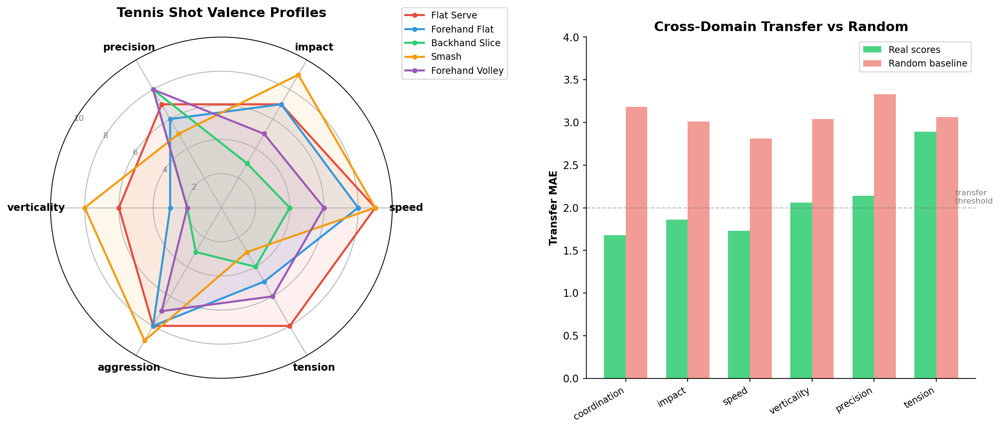

# vScore: Pre-Linguistic Visual Intelligence

A framework for visual intelligence that operates below language. Videos are mapped to numerical valence vectors on domain-specific outcome axes. Zero is homeostasis. Everything above zero is cost.

No words anywhere in the pipeline.



*Left: Tennis shot valence profiles. Each shot is a direction in valence space, not a label. Right: Cross-domain transfer vs. random baseline. Five of six axes transfer 30-47% better than chance.*

## The idea

Current visual AI maps pixels to words. Biology does the opposite: a gazelle flees before it knows the word "lion." A firefighter reads a blaze and acts before articulating why. The evaluation is pre-linguistic, operating on outcome-relevant axes (threat, speed, containment, momentum) through threshold dynamics, not categorisation.

vScore formalises this as:

```
pixels → encoder → valence scores → trajectory projection → threshold trigger → [language, optionally]
```

Built on [V-JEPA 2](https://arxiv.org/abs/2603.14482) (LeCun et al., Meta FAIR) as the frozen visual encoder. If the encoder learns to see without words, what should the evaluation layer look like? Our answer: biological valence scoring.

## Results

213 videos, 13 categories, 2 datasets (Kinetics-mini, HACS). Within-domain MAE: **0.79** on a 0-10 scale.

**Cross-domain transfer** (train on 12 categories, test on held-out 13th):

| Axis | Mean MAE | Transfers in | Status |
|------|----------|-------------|--------|
| coordination | 1.45 | 11/13 (85%) | Universal |
| impact | 1.47 | 9/13 (69%) | Universal |
| speed | 1.74 | 8/13 (62%) | Universal |
| verticality | 2.16 | 7/13 (54%) | Semi-universal |
| precision | 2.56 | 6/13 (46%) | Semi-universal |
| tension | 3.13 | 5/13 (38%) | Domain-specific |

Coordination, impact, and speed are universal visual primitives that transfer to unseen domains. Tension is genuinely domain-specific.

**Random baseline control** (scrambled scores, averaged over 5 runs):

| Axis | Real MAE | Random MAE | Ratio | Verdict |
|------|----------|------------|-------|---------|
| coordination | 1.68 | 3.18 | 0.53 | **SIGNAL** |
| speed | 1.73 | 2.81 | 0.62 | **SIGNAL** |
| impact | 1.86 | 3.01 | 0.62 | **SIGNAL** |
| precision | 2.14 | 3.33 | 0.64 | **SIGNAL** |
| verticality | 2.06 | 3.04 | 0.68 | **SIGNAL** |
| tension | 2.89 | 3.06 | 0.95 | noise |

Five of six axes transfer 30-47% better than random chance (overall ratio 0.67). This rules out the objection that transfer is an artefact of parameter capacity.

## Quick start

```bash
pip install torch transformers av numpy
git clone https://github.com/Tennisee-data/vScore.git
cd vScore
```

### Run the fire simulation demo (no GPU, no downloads)

```bash
python -m vScore.demo
```

### Run action inference demo

```bash
python -m vScore.demo_actions
```

Shows how four vectors with identical magnitude (~10.0) produce four different actions (flee, fight, bond, freeze) depending on direction. Magnitude is arousal. Direction is meaning.

### Run the multimodal demo

```bash
python -m vScore.demo_multimodal
```

Same scoring mechanism across vision and audio. A locomotive approaching: vision scores fear=4, audio scores fear=9. The word "locomotive" is never needed.

### Run the dual-system demo (vScore + LLM)

```bash
python -m vScore.demo_dual_system
```

vScore gates the LLM. Clear threats are handled in milliseconds without words. Ambiguous situations escalate to linguistic reasoning. "I flinched before I knew why" = vScore fired before the LLM started.

### Compare the two Bayesian posteriors

```bash
# Unit-precision Gaussian vs Normal-Gamma on synthetic streams (univariate + multivariate)
python -m vScore.demo_bayesian_compare

# End-to-end memory comparison on the firefighter scenario
python -m vScore.demo_memory_bayesian_compare
```

The first script verifies the Normal-Gamma math numerically (LOO via sufficient-stat subtraction matches refit, MC sampling matches Student-t predictive) and shows where it improves on the unit-precision Gaussian. The second runs the same firefighter scenario through both kinds and shows the retention difference (5/5 vs 1/5 EVACUATE-class events).

### Train on real video (requires V-JEPA 2 download, ~30 min on CPU)

```bash
# Extract features (one-time, cached forever)
python -m vScore.extract_batch

# Train and run cross-domain transfer
python -m vScore.train_v2
```

## Architecture

```
vScore/
├── core/
│   ├── metaclass.py         # ScoredDomain metaclass
│   ├── valence.py           # ValenceVector, ValenceTrajectory
│   ├── threshold.py         # Dynamic threshold triggering
│   ├── action_space.py      # Geometric action inference
│   ├── memory_bayesian.py   # Posterior-aware experience memory (Gaussian + Normal-Gamma)
│   ├── memory_bayesian_ng.py # Normal-Gamma posterior (Bishop PRML §2.3.6) + verification suite
│   ├── multimodal.py        # Cross-modal fusion in valence space
│   ├── dual_system.py       # vScore + LLM integration
│   └── prosody.py           # Voice intonation scoring
├── domains/
│   ├── survival.py          # Panksepp's 7 primal circuits
│   ├── fire.py              # Firefighting
│   ├── hockey.py            # Sport dynamics
│   ├── trading.py           # Market dynamics
│   ├── weather.py           # Atmospheric conditions
│   ├── sound.py             # Auditory threat/safety
│   ├── industrial.py        # Machine monitoring
│   └── music.py             # Affective musical scoring
├── encoder/
│   └── bridge.py            # V-JEPA 2 to valence head
├── projection/
│   └── temporal.py          # Trajectory projection
└── paper/
    └── vscore_paper.md      # Full paper
```

## Defining a new domain

10 lines of Python:

```python
from vScore.core.metaclass import DomainBase

class Surgery(DomainBase):
    axes = [
        "bleeding",        # Hemorrhage severity
        "tissue_exposure",  # Surgical field visibility
        "instrument_proximity", # Distance to critical structures
        "patient_stability",    # Vital sign deviation
        "time_pressure",        # Urgency of completion
    ]
```

The encoder, valence head, action inference, trajectory projection, threshold triggering, and Bayesian memory all work identically on this new domain without any code changes.

## Key concepts

**Zero is homeostasis.** Every non-zero score is a cost. The system exists to return to zero.

**Direction, not magnitude.** Four vectors with the same energy produce four different actions depending on which axes are activated. A classifier says "high activation" for all four. The valence scorer says flee, fight, nurture, or freeze.

**Trajectory, not snapshot.** The system projects where each axis is heading and acts on the projection. A fire at intensity=5 that is accelerating triggers earlier than a fire at intensity=7 that is stable.

**Bayesian memory.** Experiences are stored, recalled, and selectively forgotten based on their statistical contribution to the posterior. Surprising events are kept. Routine ones are discarded. The prior sharpens over time. Replay recomputes all retention scores against the current posterior to eliminate sequential bias. Two posterior kinds are available: a unit-precision diagonal Gaussian (default, fastest) and a Normal-Gamma (Bishop PRML §2.3.6) that learns per-axis variance from data. On the firefighter scenario the Normal-Gamma retains 5/5 EVACUATE-class events versus 1/5 under the unit-precision Gaussian, because it correctly calibrates surprise to per-axis scale instead of treating all axes as unit-variance.

**Modality-agnostic.** The valence vector is the universal interface. Vision, audio, and any future modality produce vectors in the same space. Fusion happens in valence space, not feature space. Modality conflict (audio says danger, vision says safe) is itself a diagnostic signal.

**Language is optional.** Words enter at the last layer as a lookup table. The intelligence lives in levels 0-2. Level 3 is serialization for human consumption.

## Built on

- [V-JEPA 2](https://arxiv.org/abs/2603.14482) (Bardes, LeCun et al., Meta FAIR) for visual encoding
- [Panksepp (1998)](https://global.oup.com/academic/product/affective-neuroscience-9780195178050) for the primal affective circuits
- [LeCun (2022)](https://openreview.net/pdf?id=BZ5a1r-kVsf) for the JEPA architecture and the argument that LLMs are insufficient for world understanding
- [HACS](https://github.com/hangzhaomit/HACS-dataset) (Zhao et al., 2019) for action video data

## Status

Preliminary research. The approach shows promise but more extensive experiments are needed: larger datasets, real expert annotations, audio encoder integration, and temporal sequence testing. See the [paper](paper/vscore_paper.md) for full discussion.

## License

MIT
